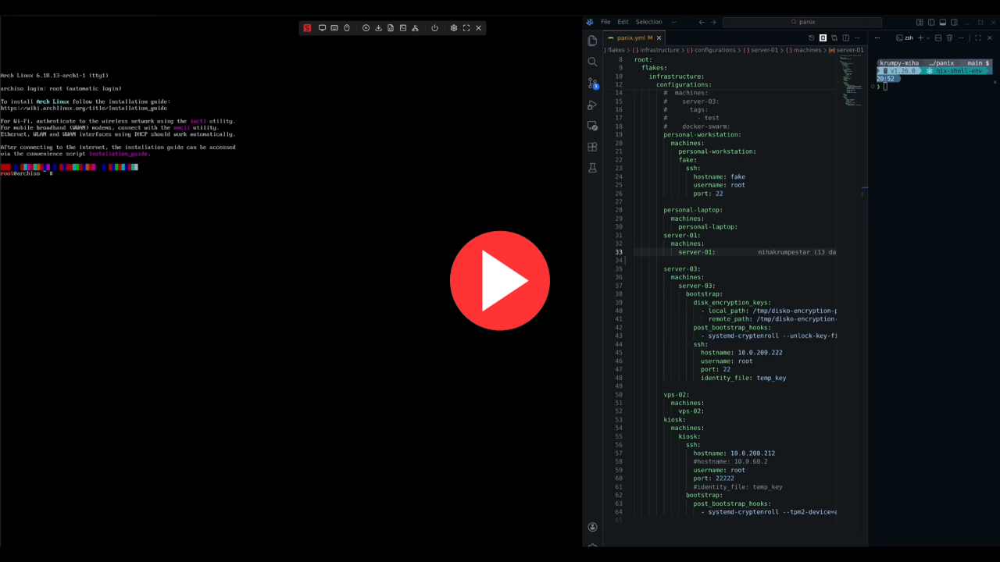
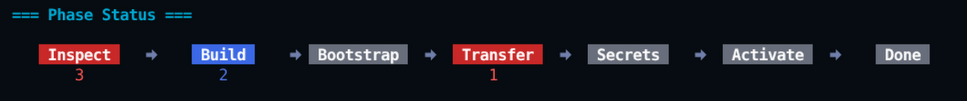
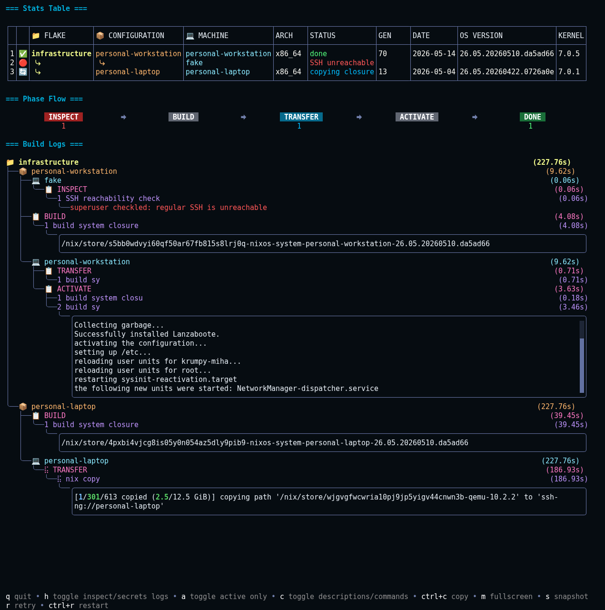

<div align="center">

# Panix

**A Deployment Orchestrator for NixOS**

*Stateless, phase-oriented deployment with real-time visibility across multi-flake fleets*

[](https://github.com/mihakrumpestar/panix/releases)
[](https://github.com/mihakrumpestar/panix/blob/main/LICENSE)
[](https://go.dev/)
[](https://goreportcard.com/report/github.com/mihakrumpestar/panix)
[](https://github.com/boyter/scc/)
[](https://nixos.org)

</div>

---

> [!WARNING]
> The tool is currently in beta stage. There might be breaking changes.

## Demo


> [mp4 version](assets/demo.mp4)

Full demo of the bootstrap process with kexec over Arch:

[](https://spectra.video/w/t2j1bDbQGS2TgLGm1RqfPH)

> It auto-enrolls Lanzaboote and TPM2 disk encryption bound to Secure Boot. Note that video does not show the steps to enable Audit/Setup mode of Secure Boot in BIOS. Note that it was made with an older version of TUI, and therefore looks slightly different.

---

## The Problem

Deploying NixOS at scale introduces operational challenges that existing tools address partially but not holistically:

- **Fragmented tooling**: `nixos-anywhere` handles bootstrapping bare-metal machines, while `deploy-rs` and `Colmena` manage deployment orchestration. Each tool excels within its domain, but integration between bootstrap and ongoing deployment cycles remains manual.
- **Missing visibility**: Deployment failures require parsing scrollback logs after execution completes. There's no unified view of what phase failed, which machine is affected, or the current state across a heterogeneous fleet.
- **Implicit dependencies**: Most deployment tools require modifying your flake to include their module or output, creating a dependency that complicates using alternative tools later.
- **No retry mechanism**: When a phase fails mid-execution, the typical workflow is to restart from scratch. Partial progress is discarded rather than preserved and recoverable.

Panix addresses these problems by providing deployment orchestration with built-in visibility and interactivity.

---

## What Panix Is

Panix is a deployment orchestrator for NixOS flakes. It provides:

- **Stateless operation**: No persistent state is maintained between runs. All information is derived from your flake, configuration file, and runtime machine inspection.
- **Phase-oriented execution**: Six sequential phases - Inspect, Build, Bootstrap, Transfer, Secrets, Activate - execute with defined scopes. The Build phase runs once per configuration, deduplicating work across machines sharing the same `nixosConfiguration`.
- **Real-time TUI**: An interactive interface provides visibility into each phase per machine. You can observe failures as they occur, inspect logs, and retry failed phases without restarting the entire workflow.
- **Bootstrap support**: Non-NixOS machines can be converted to NixOS via kexec and `disko`, with full support for disk encryption, TPM enrolment, and custom hooks at multiple stages.
- **Flake-agnostic configuration**: The deployment configuration is separate from your flake. No modifications to your flake are required to use Panix.

---

## The Phase Pipeline

Panix doesn't just "*run a deployment*". It executes an ordered pipeline of phases, each with a specific scope and purpose:

<div align="center">

Inspect → Build → Bootstrap → Transfer → Secrets → Activate

</div>

**Scope-aware execution**: The `build` phase runs once per configuration, not per machine. If three machines share the same `nixosConfiguration`, you build once. The closure is then transferred to all three machines independently in parallel.

**Phase-by-phase breakdown:**

| Phase | Scope | Purpose |
|-------|-------|---------|
| **Inspect** | Per-machine | TCP reachability, SSH authentication, architecture detection, OS detection, generation discovery |
| **Build** | Per-configuration | Build `config.system.build.toplevel` closure via `nix build --json` |
| **Bootstrap** | Per-machine | kexec into NixOS installer (if needed), disko partitioning, encryption keys transfer (if provided) |
| **Transfer** | Per-machine | `nix copy` closure to target (handles `/mnt` for bootstrapped systems) |
| **Secrets** | Per-machine | Transfer files/directories with proper ownership via rsync |
| **Activate** | Per-machine | `nixos-install` (bootstrap) or `switch-to-configuration switch` (deploy) |

The TUI shows this unfolding in real-time:



When a phase fails, you don't have to restart everything. You inspect the logs, understand the failure, maybe do a quick fix in code or on remote, and press `r` to retry just the failed phases.

Or if it changed beyond a phase, just restart the whole workflow with `ctrl+r` without leaving the TUI.

---

## Features

<details>
<summary><strong>Hierarchical Configuration Inheritance</strong></summary>

Your infrastructure has natural hierarchies: flakes contain configurations, configurations contain machines. Panix's configuration model reflects this:

<div align="center">

Root → Flake → Configuration → Machine

</div>

Attributes at each level cascade down, without overriding child attributes. Slices (tags, secrets, disk encryption keys) **append**. Define once at the root, extend at any level:

```yaml
root:
  tags: [production]              # Inherited by all descendants
  secrets:                        # Inherited by all descendants
    - local_path: ./secrets/common.key
      remote_path: /var/secrets/common.key
  
  flakes:
    infrastructure:
      tags: [critical]            # Accumulated: [production, critical]
      secrets:                    # APPENDED to inherited secrets
        - local_path: ./secrets/prod/api.key
          remote_path: /var/secrets/api.key
      
      configurations:
        webserver:
          tags: [web]             # Accumulated: [production, critical, web]
          
          machines:
            web-01:               # Accumulated: [production, critical, web, web-01]
            web-02:
              secrets:            # APPENDED to all inherited secrets
                - local_path: ./secrets/web-02/cert.pem
                  remote_path: /etc/ssl/cert.pem
```

</details>

<details>
<summary><strong>Bootstrap: From Nothing to NixOS</strong></summary>

The bootstrap flow is where Panix distinguishes itself most clearly:

1. **Inspect phase** detects the target OS; if not NixOS, **kexec** boots into a NixOS installer image
2. **Disko** partitions disks according to your configuration
3. **Transfer** system closure
4. **nixos-install** lays down the system
5. **Reboot** into your new NixOS system

```yaml
machines:
  bare-metal:
    ssh:
      hostname: 192.168.1.100
    bootstrap:
      disk_encryption_keys:       # Transferred BEFORE disko runs
        - local_path: ./secrets/luks.key
          remote_path: /tmp/luks-key
      post_bootstrap_hooks:       # Run after disko partitioning
        - systemd-cryptenroll --tpm2-device=auto /dev/nvme0n1p2
```

### Bootstrap Hooks

Panix provides multiple hook points during bootstrap:

| Hook | When it runs | SSH used |
|------|--------------|----------|
| `post_bootstrap_hooks` | After disko partitioning | Bootstrap SSH |
| `post_bootstrap_install_hooks` | After nixos-install, before reboot | Bootstrap SSH |
| `post_bootstrap_provisioned_hooks` | After reboot into new system | Regular SSH |

Special hook commands:

- `waitForOnline` - Wait for machine to become reachable (useful after reboot)
- `waitForOffline` - Wait for machine to become unreachable (useful during reboot)

```yaml
machines:
  server:
    bootstrap:
      post_bootstrap_hooks:
        - systemd-cryptenroll --tpm2-device=auto /dev/sda2
      post_bootstrap_install_hooks:
        - echo "Installation complete, preparing for reboot"
      post_bootstrap_provisioned_hooks:
        - reboot # second reboot
        - waitForOffline
        - waitForOnline
        - systemctl enable --now my-service
```

#### Bootstrap SSH

For machines that need initial provisioning (eg. bootstrap) you **must specify** SSH credentials.

```yaml
machines:
  server:
    ssh:                          # Regular SSH (after bootstrap)
      hostname: 192.168.1.100
      port: 9999
      identity_file: ./keys/prod.key
    bootstrap:
      ssh:                        # Bootstrap SSH (during bootstrap)
        hostname: 192.168.1.100
        identity_file: ./keys/temp.key
```

Important requirements:

- **Unbootstrapped machines**: must have bootstrap SSH configured (unless `force_bootstrap: true`)
- **Bootstrapped machines**: must not have bootstrap SSH configured (unless `force_bootstrap: true`)
- The `force_bootstrap` option explicitly allows bypassing these requirements
- **Inspect** phase will error if you will try to use bootstrap SSH config on an already bootstrapped machine and vice versa (regular SSH config will error on an un-bootstrapped machine)

**Workflow:**

1. During **Inspect** phase: Panix validates SSH configuration matches machine state
2. Later phases:

   - If bootstrapping: Uses bootstrap SSH for all bootstrap operations; after reboot: automatically switches to regular SSH

   - If already bootstrapped: uses regular SSH

#### SSH Key Checking Options

```yaml
ssh:
  # Enable strict host key checking (default: true for regular SSH)
  strict_key_checking: true
  # Disable auto-adding host keys (default: false for regular SSH)
  disable_auto_add_host_key: false
```

Defaults:

- **Regular SSH**: `strict_key_checking: true`, `disable_auto_add_host_key: false` (automatically trusts new machines, but checks public key if they were already added before)
- **Bootstrap SSH**: `strict_key_checking: false`, `disable_auto_add_host_key: true` (don't check anything and don't add machines public keys to trusted known ones)

#### Disable Automatic Reboot

To prevent automatic reboot after `nixos-install` (useful for manual inspection or custom reboot handling):

```yaml
machines:
  server:
    bootstrap:
      disable_automatic_reboot: true
```

</details>

<details>
<summary><strong>Reinstalling a Live NixOS Installation</strong></summary>

Panix can force a reinstall of an already running NixOS system. This is useful when you want to completely wipe and reinstall a machine from scratch.

```yaml
machines:
  existing-nixos:
    ssh:
      hostname: 192.168.1.100
    bootstrap:
      allow_destructive_actions: true    # Required for force_bootstrap
      force_bootstrap: true              # Force bootstrap even if NixOS detected
      force_bootstrap_kexec: true        # Use kexec to boot into installer first
      kexec:
        ssh_port: 22                     # SSH port for kexec installer (default: 22)
```

### How it works

Kexec allows detaching from your running NixOS by loading a new kernel and initramfs directly into memory, bypassing the BIOS/UEFI boot process. This means Panix can boot into a NixOS installer image without requiring physical access to reboot the machine. Once in the installer environment, disko can repartition the disks, and the standard bootstrap flow continues - transfer the closure (kexec does not reuse the previous one), run `nixos-install`, and reboot into the freshly installed system.

### SSH after kexec starts

After kexec starts, Panix reconnects using:

- Same SSH settings from previously used SSH method (hostname, username, identity_file)
- Port from `kexec.ssh_port` (default: 22 for the default kexec image)

If your custom kexec installer uses a different SSH port, configure it:

```yaml
bootstrap:
  kexec:
    ssh_port: 22222  # Custom SSH port for kexec installer
```

</details>

<details>
<summary><strong>Custom kexec image</strong></summary>

You can provide a custom kexec tarball:

```yaml
bootstrap:
  kexec:
    url: https://example.com/custom-kexec-<arch>.tar.gz #  Optional custom image tarball (default: https://github.com/nix-community/nixos-images/releases/latest/download/nixos-kexec-installer-noninteractive-<arch>-linux.tar.gz);
    # <arch> placeholder replaced with detected architecture
    extra_flags: "--no-sync"  # Optional flags passed to kexec (default: "")
    ssh_port: 22 # Optional kexec ssh port (default: 22)
```

</details>

<details>
<summary><strong>Secrets Management</strong></summary>

Deploy sensitive files and directories to your machines with proper ownership and permissions. The secrets phase handles the transfer of plain files/directories via `rsync` with configurable user/group ownership and file permissions:

```yaml
root:
  secrets:                              # Inherited by all machines
    - local_path: ./secrets/common.key
      remote_path: /var/secrets/common.key
      permissions: 0600                # File permissions (default: 0700)
  
  flakes:
    my-flake:
      secrets:                         # APPENDED to inherited secrets
        - local_path: ./secrets/api.key
          remote_path: /var/secrets/api.key
      
      configurations:
        webserver:
          machines:
            web-01:
              secrets:                  # Further appended secrets
                - local_path: ./secrets/web-01/cert.pem
                  remote_path: /etc/ssl/cert.pem
                  uid: 1000            # User ID (default: SSH user's uid)
                  gid: 1000            # Group ID (default: SSH user's gid)
                  permissions: 0644
```

Key features:

- **Inheritance**: Secrets defined at root/flake/configuration levels accumulate down to machines
- **Ownership control**: Optionaly set `uid` and `gid` for remote file ownership. Default are the SSH user's `uid` and `gid`.
- **Permission control**: Optionaly set `permissions` using octal notation (e.g., `0600`, `0644`). Default is `0700`.
- **Directory support**: Transfer entire directories by pointing `local_path` to a directory
- **Bootstrap awareness**: Secrets are transferred to the correct path whether targeting a running NixOS system or a bootstrapped machine. During bootstrap, the target root is mounted at `/mnt`, so Panix automatically prefixes paths (e.g., `/var/secrets/key` becomes `/mnt/var/secrets/key`) to place files in the correct location.

**Security advantage**: Secrets are transferred directly to the target machine via `rsync` and are never committed to the Nix store. This means you can safely deploy **unencrypted** secrets without them being stored in `/nix/store` (which is world-readable by default). This is fundamentally different from tools like `agenix` or `sops-nix`, which require secrets to be encrypted before they enter the Nix store.

**When secrets are transferred:**

Regular secrets are transferred during the Secrets phase (after Transfer, before Activate). Disk encryption keys have a special timing - they're transferred during Bootstrap, **before** `disko` runs, so they're available for disk encryption setup.

</details>

<details>
<summary><strong>Local Kexec Tarball</strong></summary>

For machines without internet access or for faster deployments, download the kexec tarball locally and Panix will transfer it instead of downloading it remotely.

**Download locally:**

```bash
export ARCH=x86_64  # or aarch64

curl -L -o ./kexec-$ARCH.tar.gz \
  https://github.com/nix-community/nixos-images/releases/latest/download/nixos-kexec-installer-noninteractive-$ARCH-linux.tar.gz
```

**Configure in `panix.yaml`:**

```yaml
machines:
  my-machine:
    ssh:
      hostname: 192.168.1.100
    bootstrap:
      kexec:
        url: ./kexec-<arch>.tar.gz  # <arch> placeholder replaced with detected architecture
```

The `<arch>` placeholder is automatically replaced with the detected architecture (eg. `x86_64`). Panix detects whether `url` is a local path or HTTP URL - local paths are transferred via `rsync`, URLs trigger remote download with `curl`.

</details>

<details>
<summary><strong>Nix Command Flags</strong></summary>

Pass additional flags to nix commands (`nix build`, `nix copy`, `nixos-install`) through configuration:

```yaml
root:
  nix:
    extra_flags: ["--option", "sandbox", "false"]  # Applied to both build and copy
  
  flakes:
    my-flake:
      configurations:
        webserver:
          nix:
            build_flags: ["--max-jobs", "8"]       # nix build only
            copy_flags: ["--compress"]             # nix copy only
            extra_flags: []                        # Inherits + appends from parent
          
          machines:
            web-01:
              nix:
                copy_flags: ["--compress"]         # Inherits + appends from parent
                nixos_install_flags: ["--no-bootloader"]  # nixos-install only
```

**Inheritance**: Flags accumulate down the hierarchy (root → flake → configuration → machine). Slices are appended, not replaced.

**Scope matters**:

- `build_flags` and `extra_flags` for `nix build` should be set at **configuration** level (build runs once per configuration)
- `copy_flags` for `nix copy` can be set at **machine** level (transfer runs per machine)
- `nixos_install_flags` for `nixos-install` can be set at **machine** level (bootstrap runs per machine)

</details>

<details>
<summary><strong>Multi-Flake Deployments</strong></summary>

Your infrastructure may span multiple flakes/repositories. Panix treats this as a first-class concern:

```yaml
root:
  flakes:
    infrastructure:
      url: path:../infra-flake
      configurations:
        servers:
          machines:
            server-01:
            server-02:
    
    monitoring:
      url: github:myorg/monitoring-flake
      configurations:
        prometheus:
          machines:
            prom-01:
    
    secrets-management:
      url: git+ssh://git@github.com/myorg/vault-nixos
      configurations:
        vault:
          machines:
            vault-01:
```

With this you get complete visibility across your entire infrastructure. Each flake builds independently, each configuration deduplicates builds across its machines.

</details>

<details>
<summary><strong>Real-Time TUI</strong></summary>



The stats table shows you what matters:

- architecture (for cross-compilation awareness)
- generation (for rollback context)
- NixOS version
- kernel version

Click and navigate (`left`/`right` keys) to any machine to filter build logs. This also works for phase status.

#### Keybinds

| Key | Action |
|-----|--------|
| `r` | Retry failed phases |
| `ctrl+r` | Restart entire workflow (this does not reread the yaml config) |
| `m` | Toggle logs fullscreen (make any build logs label or command output in build logs fullscrean for easier reading) |
| `ctrl-c` | Copy active build logs label or command output to clipboard |
| `c` | Toggle labels between descriptions and raw commands |
| `h` | Toggle to include `inspect` and `secrets` phases in the build logs |
| `a` | Show only active/errored build logs |
| `left`/`right` | Navigate between stats table or phase status entrys |
| `mouse click` | Select and entry from stats table, phase status, build logs command label or command output |
| `mouse scroll`/`up`/`down` | Allows scrolling main view or an inner view when selected (eg. command output) |
| `q` | Quit |

</details>

<details>
<summary><strong>Maximizing Visibility for Large Fleets</strong></summary>

When deploying to many machines, maximize visibility with:

- Show only active/errored build logs: `a` keybind or `--tui.show-active-only` flag
- Reduce build log viewport height: `--tui.command-output-max-height=N` (default: 8)

Example for minimal build logs, maximum space for machine stats:

```bash
panix deploy --tui.show-active-only --tui.command-output-max-height=2
```

Or in config:

```yaml
flags:
  tui:
    show_active_only: true
    command_output_max_height: 2
```

</details>

<details>
<summary><strong>Tag-Based Filtering</strong></summary>

Every name (flake, configuration, machine) is automatically a tag. Tags accumulate through inheritance. Deploy subsets of your infrastructure:

```bash
panix --tags production         # All production-tagged machines
panix --tags webserver          # All machines under webserver config
panix --tags server-01          # Single machine
panix --tags server-01,special  # Single machine and tag special
```

</details>

<details>
<summary><strong>SSH Config Integration</strong></summary>

Panix reads `~/.ssh/config`. If your machine name matches a host alias:

```yaml
machines:
  production-server-01:     # Uses SSH config: Host, Port, User, IdentityFile
```

No duplication. Your SSH config is the source of truth for connection parameters.

If you don't use SSH config or need to add/change something temporarily you can specify SSH options directly:

```yaml
machines:
  my-server:
    ssh:
      hostname: 192.168.1.100
      port: 2222
      username: admin
      identity_file: ./keys/server.key
      strict_key_checking: true      # Disable strict host key checking
      disable_auto_add_host_key: false  # Prevent auto-adding host keys
```

</details>

<details>
<summary><strong>Local Machine Detection</strong></summary>

Deploying to the machine you're on? If the machine name matches the system hostname, Panix skips SSH entirely - executing commands directly via local shell:

```yaml
# On a machine with hostname "workstation"
machines:
  workstation:              # Detected as local, no SSH
```

This can be overriden (if you want to prevent this, or if hostname detecton does not work):

```yaml
flags:
  override_local_machine: my-local-machine
```

</details>

<details>
<summary><strong>CI/CD Ready and Dry Run</strong></summary>

```bash
# Exit when complete, fail fast on any error
panix --exit-on-complete --require-all-success

# Dry run: show what would happen
panix --dry-run

# Dry run with real status queries (inspects machines, doesn't build/transfer)
panix --dry-run-with-inspect
```

</details>

<details>
<summary><strong>Template Engine</strong></summary>

Panix includes a powerful template engine for dynamic YAML configuration. Templates use standard Go template syntax with `{{` and `}}` delimiters and support 100+ built-in functions from the [Sprout](https://github.com/go-sprout/sprout) library.

### Basic Syntax

Environment variables and dynamic values:

```yaml
root:
  flakes:
    my-flake:
      url: {{ env "MY_FLAKE_URL" }}
      configurations:
        server:
          machines:
            server-01:
              ssh:
                hostname: {{ env "SERVER_HOST" | default "192.168.1.100" }}
                port: {{ env "SSH_PORT" | default "22" }}
```

### Conditional Logic

Use conditionals for environment-specific configurations:

```yaml
root:
  flakes:
    {{if eq (env "ENV") "production"}}
    prod-flake:
      url: github:myorg/prod-config
    {{else}}
    dev-flake:
      url: github:myorg/dev-config
    {{end}}
```

### Template Definitions

Define reusable templates with `{{define}}` and invoke them with `{{template}}`:

```yaml
# Define template (in YAML comment to avoid LSP errors)
# {{define "cryptenroll"}}systemd-cryptenroll --unlock-key-file=/tmp/disko-encryption-password.txt --tpm2-device=auto --tpm2-with-pin=no --wipe-slot=all {{.}}{{end}}

root:
  flakes:
    infrastructure:
      configurations:
        server:
          machines:
            server-01:
              bootstrap:
                post_bootstrap_hooks:
                  - |
                    {{template "cryptenroll" "/dev/sda2"}}
            
            server-02:
              bootstrap:
                post_bootstrap_hooks:
                  - |
                    {{template "cryptenroll" "/dev/nvme0n1p2"}}
```

### Built-in Functions

Panix provides 100+ functions from Sprout, documentaion is available in [Sprout docs](https://docs.atom.codes/sprout/registries/list-of-all-registries).

### YAML Anchors

Use YAML anchors for reusable blocks alongside templates:

```yaml
bootstrap_defaults: &bootstrap_defaults
  disk_encryption_keys:
    - local_path: /tmp/disko-encryption-password.txt
      remote_path: /tmp/disko-encryption-password.txt

root:
  flakes:
    infrastructure:
      configurations:
        server:
          machines:
            server-01:
              bootstrap:
                <<: *bootstrap_defaults
                post_bootstrap_hooks:
                  - systemd-cryptenroll --tpm2-device=auto /dev/sda2
```

### Eval Command

Preview the processed YAML with templates evaluated and anchors resolved:

```bash
panix eval                    # Output to stdout (colorized)
panix eval -o processed.yaml  # Output to file (plain YAML)
```

The `eval` command:

- Resolves all `{{...}}` template expressions
- Merges YAML anchors
- Preserves original key order
- Filters anchor-only definitions (keeps only `flags` and `root`)

### Notes

- Template definitions (`{{define}}`) work inside YAML comments
- Standard Go template syntax with `{{` and `}}` delimiters
- YAML LSP may complain about template syntax - this is cosmetic
- For complex multiline templates, use block scalars (`|`) in hooks

</details>

<details>
<summary><strong>IDE Support</strong></summary>

You can directly reference the YAML schema for autocompletion and validation:

```yaml
# yaml-language-server: $schema=https://raw.githubusercontent.com/mihakrumpestar/panix/main/gen/panix-schema.yaml

...
```

Or you can generate it locally:

```bash
panix schema
```

and reference it:

```yaml
# yaml-language-server: $schema=./panix-schema.yaml

...
```

</details>

---

## Installation

Run directly:

```sh
nix run github:mihakrumpestar/panix -- deploy
```

Add to your flake:

```nix
{
  inputs = {
    nixpkgs.url = "github:NixOS/nixpkgs/nixos-unstable";

    panix.url = "github:mihakrumpestar/panix";
  };

  outputs = { self, nixpkgs, panix, ... }@inputs: {
    nixosConfigurations.my-server = nixpkgs.lib.nixosSystem {
      system = "x86_64-linux";
      modules = [
        ./configuration.nix
        {
          environment.systemPackages = [
            panix.packages.${system}.default
          ];
        }
      ];
    };
  };
}
```

---

## Quick Start

Note: Remote requires SSH key authentication (key file must be without password, unless you are using an SSH agent). Password authentication is not supported.

### 1. Remote

Boot into NixOS installer, any Linux live ISO (note that it might be missing packages needed to start kexec) or your already provisioned NixOS.

### 2. SSH Authentication

If you have only password auth, create and add a temporary key to remote with the following commands:

```sh
# On remote (set password for root user)
sudo passwd
```

```sh
export REMOTE=<host>

# Generate key pair
ssh-keygen -t ed25519 -f ./temp_key -C "temporary_deployment_key" -N ""

# Copy key to remote (with disabled SSH agent to prevent trying to auth with keys in agent)
SSH_AUTH_SOCK="" ssh-copy-id -i ./temp_key.pub -o UserKnownHostsFile=/dev/null -o StrictHostKeyChecking=no root@$REMOTE
```

You now may test the login with:

```sh
ssh -i ./temp_key -o IdentitiesOnly=yes root@$REMOTE
```

Now you can get (for example) the hardware config:

```sh
nixos-generate-config --no-filesystems --show-hardware-config

# or on non-NixOS installs
nix-shell -p nixos-install-tools --command "nixos-generate-config --no-filesystems --show-hardware-config"
```

You can also create an encryption password:

```sh
# `-n` prevents adding newline, which is a problem for password enrolnment
echo -n "test" > /tmp/disko-encryption-password.txt
```

### 3. Create panix.yml

```yaml
root:
  flakes:
    my-config:
      url: path:./my-nixos-flake
      configurations:
        my-server:
          machines:
            my-server:
              ssh:
                hostname: 192.168.1.100
```

### 4. Deploy

```bash
panix deploy
```

---

## Configuration Reference

### CLI

```sh
> panix --help
Usage: panix <command> [flags]

Universal NixOS Deployment Tool

Flags:
  -h, --help                  Show context-sensitive help.
  -c, --config="panix.yml"    Config file ($PANIX_CONFIG)
      --version               Show version ($PANIX_VERSION)

Commands:
  schema [flags]
    Generate YAML schema for configuration files

  eval [flags]
    Evaluate config (process templates and anchors) and output result

  inspect [flags]
    Inspect machine per host

  build [flags]
    Build all selected closures

  deploy [flags]
    Do full workflow (inspect -> build -> bootstrap -> transfer -> secrets ->
    activate)

  secrets [flags]
    Deploy secrets to all machines

  rollback [<generation>] [flags]
    Rollback to a previous generation

Run "panix <command> --help" for more information on a command.
```

<details>
<summary>Deploy command flags</summary>

```sh
> panix deploy --help
Usage: panix deploy [flags]

Do full workflow (inspect -> build -> bootstrap -> transfer -> secrets ->
activate)

Flags:
  -h, --help                       Show context-sensitive help.
  -c, --config="panix.yml"         Config file ($PANIX_CONFIG)
      --version                    Show version ($PANIX_VERSION)

  -t, --tags=TAGS,...              Filter machines by tags (flakes, configs
                                   and names are already registered as tags)
                                   ($PANIX_TAGS)
      --bootstrap.disable-disko    Disables building, transfer and execution of
                                   disko tool ($PANIX_BOOTSTRAP_DISABLE_DISKO)
      --require-all-success        Abort if any task fails, primarily for CI/CD
                                   ($PANIX_REQUIRE_ALL_SUCCESS)
      --override-local-machine=STRING
                                   Hostname of the machine that is local
                                   (won't use ssh to connect to it)
                                   ($PANIX_OVERRIDE_LOCAL_MACHINE)
      --dry-run                    Show what would be done without executing
                                   ($PANIX_DRY_RUN)
      --dry-run-with-inspect       Show what would be done without
                                   executing, but with real inspect query
                                   ($PANIX_DRY_RUN_WITH_INSPECT)
      --timeout=2h                 Timeout per command (eg. '1h', '1m15s')
                                   ($PANIX_TIMEOUT)
  -s, --skip-phases=SKIP-PHASES,...
                                   Declare phases to skip (not all phases can be
                                   skipped) ($PANIX_SKIP_PHASES)
      --exit-on-complete           Exit TUI on completion; 'retry' and
                                   'restart' are disabled in this mode
                                   ($PANIX_EXIT_ON_COMPLETE)
      --activation-mode="switch"
                                   Activation mode: check, switch, boot, test,
                                   dry-activate ($PANIX_ACTIVATION_MODE)
      --tui.show-all-build-logs    Show all build logs in TUI (keybind h)
                                   ($PANIX_TUI_SHOW_ALL_BUILD_LOGS)
      --tui.show-active-only       Show only running or errored logs
                                   in TUI build logs (keybind a)
                                   ($PANIX_TUI_SHOW_ACTIVE_ONLY)
      --tui.show-commands-in-labels
                                   Show raw commands instead of descriptions
                                   as labels in build logs (keybind c)
                                   ($PANIX_TUI_SHOW_COMMANDS_IN_LABELS)
      --tui.command-output-max-height=8
                                   Maximum height for command labels
                                   and outputs viewports in TUI
                                   ($PANIX_TUI_COMMAND_OUTPUT_MAX_HEIGHT)
  -l, --log                        Enable logging to file ($PANIX_LOG)
      --log-file="panix.log"       Log file path ($PANIX_LOG_FILE)
  -d, --debug                      Debug output (enables logging) ($PANIX_DEBUG)
      --cpu-profile=STRING         Path for cpu profiling to file, declaring it
                                   enables it ($PANIX_CPU_PROFILE)
```

</details>

### YAML

For the complete schema, see [panix-schema.yaml](./gen/panix-schema.yaml).

#### Minimal Example

```yaml
# yaml-language-server: $schema=https://raw.githubusercontent.com/mihakrumpestar/panix/main/gen/panix-schema.yaml

root:
  flakes:
    my-config: # A name for your flake
      url: path:./my-nixos-flake
      configurations:
        my-server: # Matches "my-server" in nixosConfigurations
          machines:
            my-server: # Matches "my-server" in SSH config
```

#### Full Example

```yaml
# yaml-language-server: $schema=https://raw.githubusercontent.com/mihakrumpestar/panix/main/gen/panix-schema.yaml

flags: # Listed are default values, all also overridable using CLI arguments
  tags: []                             # Filter machines by tags (flakes, configs, machine names are auto-registered as tags)
  timeout: 2h                          # Workflow timeout (e.g. '1h', '1m15s')
  exit_on_complete: false              # Exit TUI on completion (disables retry/restart)
  require_all_success: false           # Abort if any task fails (for CI/CD)
  skip_phases: []                      # Phases to skip (not all phases can be skipped)
  override_local_machine: my-laptop    # Override which machine is considered local (no SSH)
  dry_run: false                       # Show what would happen without executing
  dry_run_with_inspect: false          # Dry run but with real inspect queries
  bootstrap:
    disable_disko: false               # Disable disko tool build/transfer/bootstrap
  tui:
    show_all_build_logs: false         # Show inspect/secrets phases in build logs (keybind h)
    show_active_only: false            # Show only running/errored logs (keybind a)
    show_commands_in_labels: false     # Show raw commands instead of descriptions (keybind c)
    command_output_max_height: 8       # Max height for command output viewports
  logging:
    log: false                         # Enable logging to file
    log_file: panix.log                # Log file path
    debug: false                       # Enable debug output (enables logging)
    cpu_profile: ""                    # Path for CPU profiling file

root:
  disabled: false                      # Disable this entire root configuration
  tags: [production]                   # Tags inherited by all descendants
  hardware_config_path: ./hardware     # Path for hardware config generation
  override_sudo_program: doas          # Override sudo program (default: sudo)
  nix:                                 # Nix command flags inherited by all descendants
    extra_flags: []                    # Flags for both nix build and nix copy
    build_flags: []                    # Flags for nix build only
    copy_flags: []                     # Flags for nix copy only
    nixos_install_flags: []            # Flags for nixos-install only
  ssh:                                 # SSH config inherited by all machines (machine-level overrides)
    hostname: ""                       # SSH hostname or IP address
    port: 22                           # SSH port number
    username: root                     # SSH username
    identity_file: ./keys/default.key  # Path to SSH private key
    strict_key_checking: true          # Enable strict host key checking
    disable_auto_add_host_key: false   # Disable auto-adding host keys on first connection
  secrets:                             # Secrets transferred to all machines
    - local_path: ./secrets/common.key
      remote_path: /var/secrets/common.key
      uid: 0                           # User ID for remote file
      gid: 0                           # Group ID for remote file
      permissions: 0600                # File permissions (default: 0700)
  
  flakes:
    infrastructure:
      url: path:../infra-flake         # Flake path or URL (e.g. 'github:...', 'git+ssh://...')
      disabled: false                  # Disable this flake
      tags: [critical]                 # Additional tags (accumulated: [production, critical])
      hardware_config_path: ./hw-config
      override_sudo_program: sudo
      ssh:                             # SSH config for all machines in this flake
        hostname: ""
        port: 22
        username: admin
        identity_file: ./keys/infra.key
        strict_key_checking: true
        disable_auto_add_host_key: false
      secrets:                         # APPENDED to inherited secrets
        - local_path: ./secrets/infra.key
          remote_path: /var/secrets/infra.key
          uid: 0
          gid: 0
          permissions: 0600
      bootstrap:                       # Bootstrap config inherited by machines
        ssh:                           # Bootstrap SSH (used during initial provisioning)
          hostname: ""
          port: 22
          username: root
          identity_file: ./keys/bootstrap.key
          strict_key_checking: false   # Default: false for bootstrap SSH
          disable_auto_add_host_key: true  # Default: true for bootstrap SSH
        kexec:                         # Kexec configuration for non-NixOS machines
          url: ""                      # Custom kexec tarball URL (default: nix-community image)
          extra_flags: ""              # Extra flags for kexec (e.g. '--no-sync')
          ssh_port: 22                 # SSH port for kexec installer (default: 22)
        disk_encryption_keys:          # Transferred BEFORE disko runs
          - local_path: ./secrets/luks.key
            remote_path: /tmp/luks-key
            uid: 0
            gid: 0
            permissions: 0700
        allow_destructive_actions: false  # Required for force_bootstrap options
        force_bootstrap: false         # Force bootstrap even if already NixOS
        force_bootstrap_kexec: false   # Force kexec even if in NixOS installer (requires force_bootstrap)
        disable_automatic_reboot: false  # Disable auto-reboot after nixos-install
        post_bootstrap_hooks: []       # Commands after disko partitioning
        post_bootstrap_install_hooks: []  # Commands after nixos-install, before reboot
        post_bootstrap_provisioned_hooks: []  # Commands after reboot (uses regular SSH)
      
      configurations:
        webserver:
          disabled: false
          tags: [web]                  # Accumulated: [production, critical, web]
          flake_output: nixosConfigurations.webserver.config.system.build.toplevel  # Override flake output
          hardware_config_path: ./hardware
          override_sudo_program: sudo
          nix:                         # Nix flags for this configuration
            extra_flags: []            # Inherits + appends from parent
            build_flags: ["--max-jobs", "4"]  # Flags for nix build
            copy_flags: []             # Flags for nix copy
            nixos_install_flags: []    # Flags for nixos-install
          ssh:
            hostname: ""
            port: 22
            username: root
            identity_file: ./keys/web.key
            strict_key_checking: true
            disable_auto_add_host_key: false
          secrets:
            - local_path: ./secrets/web.key
              remote_path: /var/secrets/web.key
              uid: 0
              gid: 0
              permissions: 0600
          bootstrap:
            ssh:
              hostname: ""
              port: 22
              username: root
              identity_file: ./keys/web-bootstrap.key
              strict_key_checking: false
              disable_auto_add_host_key: true
            kexec:
              url: ""
              extra_flags: ""
              ssh_port: 22
            disk_encryption_keys: []
            allow_destructive_actions: false
            force_bootstrap: false
            force_bootstrap_kexec: false
            disable_automatic_reboot: false
            post_bootstrap_hooks: []
            post_bootstrap_install_hooks: []
            post_bootstrap_provisioned_hooks: []
          
          machines:
            web-01:
              disabled: false
              tags: [web-01]           # Accumulated: [production, critical, web, web-01]
              hardware_config_path: ./hardware/web-01
              override_sudo_program: sudo
              nix:                     # Nix flags for this machine
                extra_flags: []        # Inherits + appends from parent
                build_flags: []        # Inherits + appends from parent
                copy_flags: ["--compress"]  # Flags for nix copy (machine-level)
                nixos_install_flags: []    # Flags for nixos-install (machine-level)
              ssh:
                hostname: 10.0.0.1
                port: 22
                username: root
                identity_file: ./keys/web-01.key
                strict_key_checking: true
                disable_auto_add_host_key: false
              secrets:
                - local_path: ./secrets/web-01.key
                  remote_path: /var/secrets/web-01.key
                  uid: 0
                  gid: 0
                  permissions: 0600
              bootstrap:
                ssh:
                  hostname: 10.0.0.1
                  port: 22
                  username: root
                  identity_file: ./keys/web-01-bootstrap.key
                  strict_key_checking: false
                  disable_auto_add_host_key: true
                kexec:
                  url: ""
                  extra_flags: ""
                  ssh_port: 22
                disk_encryption_keys: []
                allow_destructive_actions: false
                force_bootstrap: false
                force_bootstrap_kexec: false
                disable_automatic_reboot: false
                post_bootstrap_hooks: []
                post_bootstrap_install_hooks: []
                post_bootstrap_provisioned_hooks: []
            
            web-02:                    # Minimal machine entry
              ssh:
                hostname: web-02.example.com
        
        database:
          machines:
            db-01:
              ssh:
                hostname: 10.0.1.50
              bootstrap:
                ssh:
                  hostname: 10.0.1.50
                  identity_file: ./keys/bootstrap.key
                disk_encryption_keys:
                  - local_path: ./secrets/db/luks.key
                    remote_path: /tmp/luks-key
                post_bootstrap_hooks:
                  - systemd-cryptenroll --tpm2-device=auto /dev/sda2
    
    monitoring:
      url: github:myorg/monitoring#main
      configurations:
        prometheus:
          machines:
            prom-01:
```

The one used for testing to deploy [infrastructure](https://github.com/mihakrumpestar/infrastructure) is at [panix.yml](panix.yml).

---

## Requirements & Caveats

- **Nix**: Panix uses `nix` that it finds in PATH, it also uses commands like `uname`, `id`, `echo`, `cat`, `readlink`, `stat`, `curl` and `tar`
- **rsync**: Required on both local and remote for file transfers (included in `kexec` images)
- **kexec memory**: Minimum 1GB RAM without swap for `kexec` bootstrap
- **Nix store location**: Panix expects Nix store to be in standard location
- **Nix store locking**: Nix does not allow writing to store by more than one at a time, so some builds may have a `waiting for store lock` warning for a brief time until the lock is lifted
- **ssh key auth**: only ssh key auth is supported, no password auth
- **flake only**: only flakes are supported

---

## Contributing

Contributions are welcome! Whether it's bug reports, feature requests, constructive criticism, or pull requests - all feedback is appreciated. See [CONTRIBUTING.md](CONTRIBUTING.md).

---

## License

AGPL-3.0 - see [LICENSE](LICENSE).

---

<div align="center">

*If Panix has improved your deployment workflow, consider giving it a star.*

</div>
