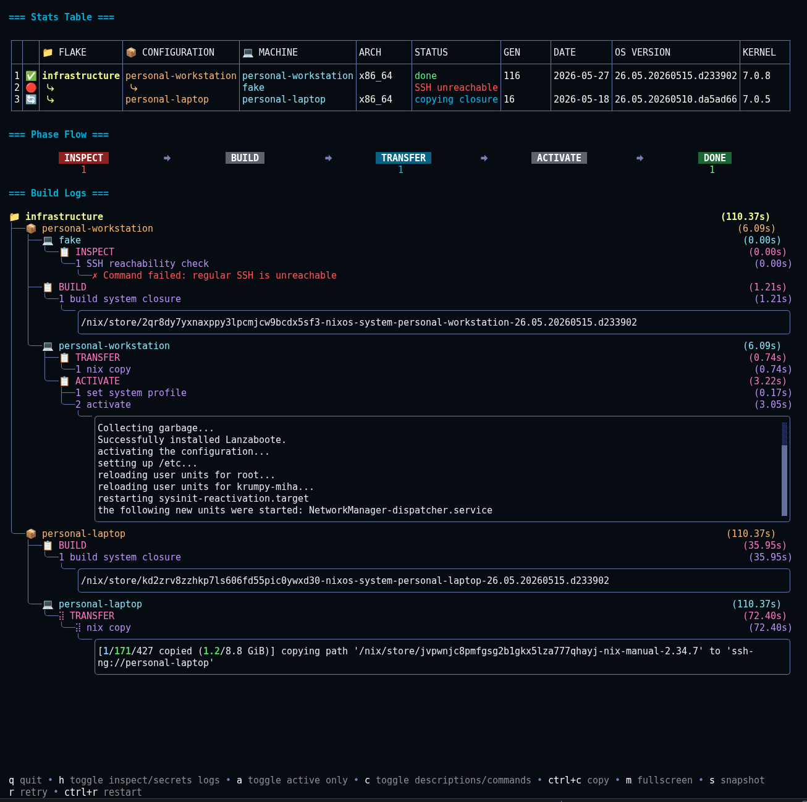

<div align="center">


# Panix

**Universal Nix Deployment Orchestrator**

*Stateless, phase-oriented deployment of Nix installables with real-time visibility across multi-flake fleets*

[](https://github.com/mihakrumpestar/panix/releases)
[](https://github.com/mihakrumpestar/panix/blob/main/LICENSE)
[](https://go.dev/)
[](https://pkg.go.dev/github.com/mihakrumpestar/panix/pkg)
[](https://github.com/mihakrumpestar/panix/actions/workflows/ci.yml)
[](https://github.com/mihakrumpestar/panix)

[](https://github.com/boyter/scc/)
[](https://github.com/vladopajic/go-test-coverage)
[](https://github.com/mihakrumpestar/panix/tree/main/tests/e2e)
[](https://nixos.org)


**[Documentation](https://panix.xyz)**

</div>

---

> [!WARNING]
> The tool is currently in beta stage. There might be breaking changes.

## Demo


Screenshot:



---

## The Problem

Deploying Nix installables, whether to a single machine or across a whole fleet, is a fragmented mess. For NixOS, you bootstrap bare metal with `nixos-anywhere`, then use `nixos-rebuild` for one machine at a time or orchestrate fleets with `Colmena`, `deploy-rs`, etc. Each tool is excellent, in isolation, the moment you try to compose them, you're on your own.

There's no unified pipeline. Bootstrap and deploy are separate workflows with separate configs. A failed phase means restarting from scratch, and partial progress is lost. Failures hide in scrollback logs or are nonexistent, discovered only after the damage is done. Most tools require modifying your flake to include their module or output, making them unusable for bootstrapping since they assume the target system is already running.

Panix eliminates all of this: one binary, one config file, full lifecycle. From bare metal to running installables, in a single orchestrated pipeline.

## What Panix Does

Panix is a stateless deployment orchestrator for Nix flake installables. It manages the entire lifecycle of deploying systems, home environments, and packages to machines, from provisioning bare metal to ongoing updates, as a single, observable, recoverable pipeline.

**Six phases, one execution:**

<div align="center">
Inspect → Bootstrap → Build → Transfer → Secrets → Activate
</div>
<br>

Each phase has a defined scope and purpose:

- **Inspect** detects OS, architecture, SSH reachability, and existing generations.
- **Bootstrap** kexecs into a NixOS installer, partitions disks with disko, and optionally encrypts.
- **Build** compiles the system closure once per installable, deduplicated across machines sharing the same installable.
- **Transfer** copies closures to targets in parallel via `nix copy`.
- **Secrets** rsyncs files with ownership and permissions, never entering the Nix store.
- **Activate** switches to the new configuration, or installs from scratch on fresh machines.

And an additional phase for **rollbacks**.

**What makes it different:**

- **Real-time TUI**: per-machine, per-phase visibility. Watch every phase unfold. Press `r` to retry only failed phases. Press `ctrl+r` to restart the entire workflow. No scrollback parsing.
- **Scope-aware deduplication**: three machines sharing the same installable trigger one build, not three.
- **Remote builds**: build on a target machine when it has more resources or a different architecture. The closure copies directly between machines.
- **Multi-flake deployments**: span multiple repositories in a single run. Each flake is independently buildable.
- **Tag-based filtering**: every name is a tag. Deploy subsets: `panix deploy --tags production`, `panix deploy --tags webserver`.
- **Secret management**: files transferred with configurable uid, gid, permissions. Never stored in `/nix/store`. Bootstrap-aware path prefixing.
- **Hooks system**: `post_bootstrap_hooks`, `post_bootstrap_install_hooks`, `post_bootstrap_provisioned_hooks`. Special commands: `waitForOnline`, `waitForOffline`.
- **Dry-run modes**: preview without connections (`--dry-run`), or with real machine inspection (`--dry-run-with-inspect`).
- **Auto rollback**: opt-in `auto_rollback` reverts machines to their pre-deploy generation when activation fails. The rollback shows as extra steps in the build logs.
- **Snapshot & replay**: capture workflow state to JSON. Replay in TUI for debugging or sharing.
- **Extensible output types**: declare custom types under `output_types` to deploy any flake output with custom build and activation semantics.
- **Flake-agnostic**: zero modifications to your flake. Configuration lives in `panix.yml`.

---

### At glance

`panix.yml`:

<!-- PANIX_YML_START -->
```yaml
# yaml-language-server: $schema=https://raw.githubusercontent.com/mihakrumpestar/panix/main/gen/panix-schema.yaml

# Minimal Panix configuration demo.
#
# All fields have sensible defaults:
#   config file: panix.yml          (can be overridden with -c)
#   flake url:   .                  (current directory, can be omitted)
#   build_mode:  local              (build locally, then nix copy)
#   activation:  switch             (default per output type, overridable per installable)
#   SSH:         machine name matched against ~/.ssh/config
#   installable: <outputType>.<name>  (e.g. nixosConfigurations.workstation)
#   inheritance: fleet → flake → installable → machine
#                (tags, secrets, SSH, bootstrap, nix cascade down)
#
# Custom flake output types can be declared under a top-level output_types: section (see docs).

fleet:
  flakes:
    my-infra:
      # url defaults to ".", can be omitted when flake is in current dir
      installables:
        nixosConfigurations:
          workstation: # nixosConfigurations.workstation
            machines:
              workstation: # matched against ~/.ssh/config

          servers: # multi-machine, build once, copy to both
            machines:
              server-eu: # matched against ~/.ssh/config
              server-us:
                ssh: # SSH not in ~/.ssh/config → specify here
                  hostname: server-us.example.com

          vps: # another single machine
            machines:
              my-vps:
                ssh:
                  hostname: 10.0.0.100
                  port: 2222

        homeConfigurations:
          dev: # homeConfigurations.dev
            machines:
              workstation: # same machine, different installable type
```
<!-- PANIX_YML_END -->

And run it with:

```sh
nix run github:mihakrumpestar/panix -- deploy
```

Prebuilt binaries are available from a Cachix cache; see the [installation docs](https://panix.xyz/getting-started/installation/) to opt in.

For the complete schema, see [panix-schema.yaml](gen/panix-schema.yaml).

---

## Documentation

Available on [panix.xyz](https://panix.xyz) or locally in [docs dir](docs/src/content/docs).

---

## Contributing

Contributions are welcome! Whether it's bug reports, feature requests, constructive criticism, or pull requests - all feedback is appreciated. See [CONTRIBUTING.md](CONTRIBUTING.md).

---

## License

Panix is licensed under [AGPL-3.0](LICENSE). Packages under `pkg` are licensed under [MIT](pkg/README.md).

For more details about licenses, see [choosingalicense.com/licenses](https://www.choosingalicense.com/licenses).

---

<div align="center">

*If Panix has improved your deployment workflow, consider giving it a star.*

</div>
