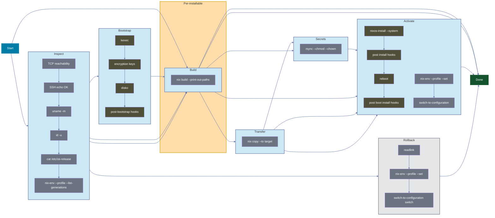

Panix doesn't just "run a deployment". It executes an ordered pipeline of phases, each with a specific scope and purpose:

**Inspect → Bootstrap → Build → Transfer → Secrets → Activate**

## Phase Breakdown

| Phase | Scope | Purpose |
|-------|-------|---------|
| **Inspect** | Per-machine | TCP reachability, SSH authentication, architecture detection, OS detection, generation discovery |
| **Bootstrap** | Per-machine | kexec into NixOS installer (if needed), disko partitioning, encryption keys transfer (if provided) |
| **Build** | Per-installable | Build the installable closure via `nix build` (local or remote mode) |
| **Transfer** | Per-machine | `nix copy` closure to target |
| **Secrets** | Per-machine | Transfer files/directories with proper ownership via rsync |
| **Activate** | Per-machine | Dispatches based on installable type: `switch-to-configuration` (nixos), `activate` (darwin/home/droid), or `nix profile add` (packages) |

## Standalone Phases

| Phase | Scope | Purpose |
|-------|-------|---------|
| **Rollback** | Per-machine | Switch to a previous NixOS generation via `switch-to-configuration` |

The rollback steps can also run automatically during Activate phase: when activation fails and the machine has `auto_rollback: true`, Panix reverts the machine to its pre-deploy generation. See [Auto Rollback](../features/auto-rollback.mdx).

## Scope-Aware Execution

The Build phase runs once per installable, not per machine. If three machines share the same installable, you build once. The closure is then transferred to all three machines independently in parallel.

## The TUI

The TUI shows this unfolding in real-time:

When a phase fails, you don't have to restart everything. Inspect the logs, understand the failure, maybe do a quick fix in code or on remote, and press `r` to retry just the failed phases.

Or if it changed beyond a phase, restart the whole workflow with `ctrl+r` without leaving the TUI.
