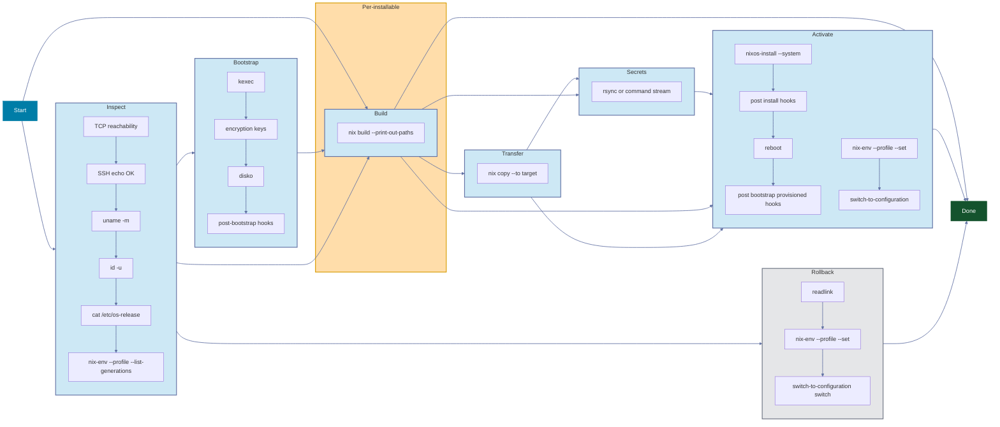

import MermaidPin from '../../../components/MermaidPin.astro';

Panix executes an ordered pipeline:

**Inspect → Bootstrap → Build → Transfer → Secrets → Activate**

<MermaidPin />

## Phase Breakdown

| Phase | Scope | Purpose |
|-------|-------|---------|
| **Inspect** | Per-machine | TCP reachability, SSH authentication, architecture and kernel detection, OS detection, Nix availability, generation discovery |
| **Bootstrap** | Per-machine | kexec into NixOS installer (if needed), encryption keys transfer (if provided), disko partitioning |
| **Build** | Per-installable | Build the installable closure via `nix build` (local or [remote mode](/configuration/build-modes/)) |
| **Transfer** | Per-machine | `nix copy` closure to target |
| **Secrets** | Per-machine | Transfer `local_path` files/directories via rsync, or stream `command` stdout to the remote path, with proper ownership |
| **Activate** | Per-machine | Dispatches based on installable type: `switch-to-configuration` (nixos), `activate` (darwin/home/droid), or `nix profile add` for `packages` (`nix profile install` when Lix is detected) |

## Standalone Phases

| Phase | Scope | Purpose |
|-------|-------|---------|
| **Rollback** | Per-machine | Switch to a previous generation via the type's activation mechanism, for any type with a profile path |

Rollback also runs automatically during Activate when activation fails and the machine has `auto_rollback: true`: see [Auto Rollback](/guides/auto-rollback/).

## Scope-Aware Execution

The Build phase runs once per installable, not per machine: three machines sharing an installable build once (see the [configuration model](/concepts/configuration-model/)). The closure is then transferred to each machine independently, in parallel.

## The TUI

The TUI shows this unfolding in real time:

When a phase fails, inspect the logs and retry just the failed phases without restarting the workflow: see [TUI keybinds](/tui/keybinds/).
