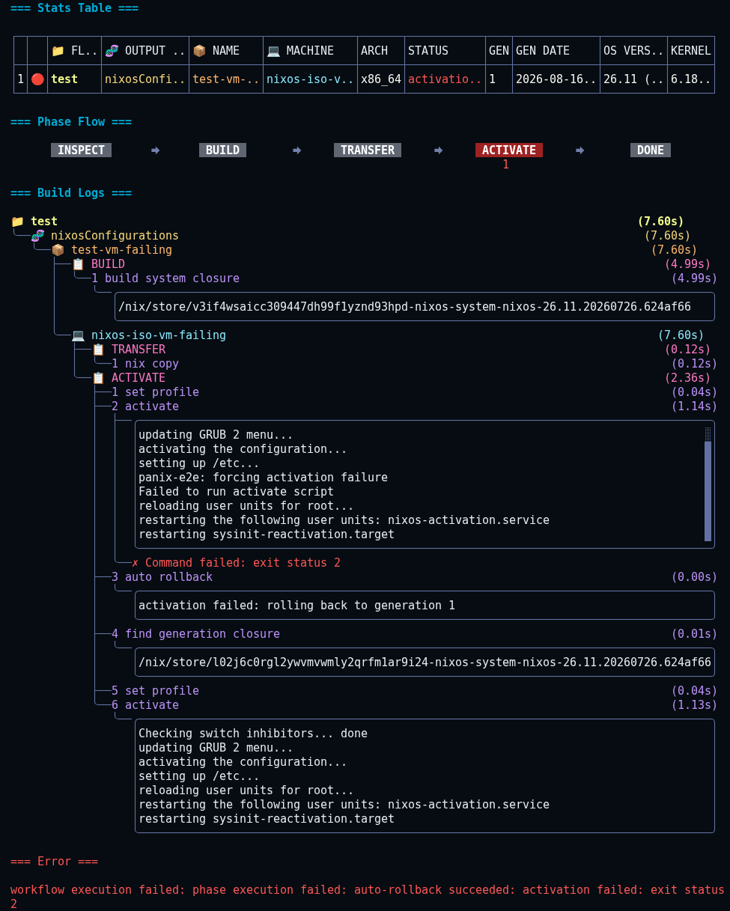

When activation fails, the machine can be left with a new system profile generation that failed to fully activate. Auto rollback reverts the machine to the generation that was active before the deploy started (captured during the Inspect phase).

```yaml
fleet:
  flakes:
    my-flake:
      installables:
        nixosConfigurations:
          webserver:
            auto_rollback: true   # opt-in per installable
            machines:
              web-01:
```

`auto_rollback` is a regular attribute: set it at fleet, flake, installable, or machine level, and it is inherited downward.

:::note
Like other boolean attributes (e.g. `disabled`), inheritance is one-way: a child that sets `auto_rollback: false` explicitly cannot opt out of a parent's `auto_rollback: true`, because `false` is indistinguishable from unset during the merge. Enable it at the lowest level you need it.
:::

## What happens on failure

1. The activation fails (e.g. `switch-to-configuration` exits non-zero after the profile was already switched).
2. Panix resolves the closure of the pre-deploy generation (the generation at Inspect time).
3. It re-runs `nix-env --profile --set` and the activation script against that closure, using the preset's default activation mode.

The rollback is visible in the build logs as an explicit step after the failed activation, so it is clear which commands are a rollback and which generation is being restored:



The deploy still reports the original activation failure. The error notes whether auto rollback succeeded or failed, so a rolled-back deploy never looks like a successful one:

```text
auto-rollback succeeded: activation failed: exit status 2
```

## When it does not run

- `auto_rollback` is not set (or resolves to false) for the machine.
- The activation mode is declared non-mutating by the installable's preset — for NixOS that is only `dry-activate`, which just prints what would happen. Custom output types can declare their own non-mutating modes via `activation_non_mutating_modes`.
- The installable has no profile path (e.g. `packages`, which install via `nix profile add` and have no generation concept).
- No previous generation was found during Inspect (e.g. a fresh machine).

The `test` mode does trigger auto rollback on failure: it skips the profile switch but still activates the configuration (restarts services, sets up `/etc`), so a failed test can leave the machine running the broken config.

For bootstrapping a new machine there is no previous generation to restore, so auto rollback never applies to the bootstrap path.

## Manual rollback

Auto rollback is automatic recovery during a deploy. To switch to an earlier generation explicitly, use the standalone rollback command:

```sh
panix rollback --gen -1   # 0=current, -N=Nth before current, N=specific generation
```

See the [phase pipeline](../concepts/phases.mdx) for how rollback fits into the deploy flow.
