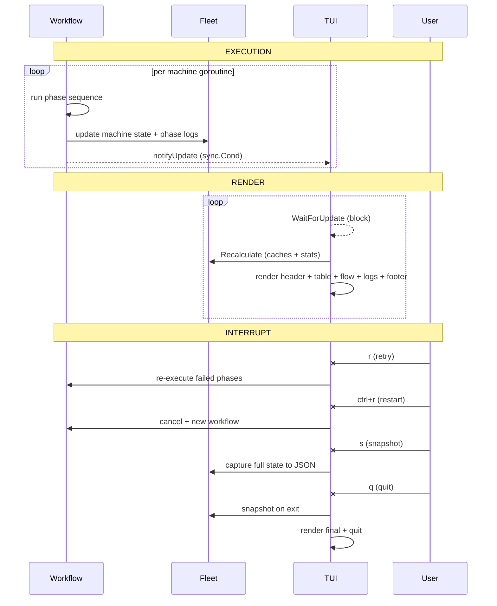

Panix uses a custom-built terminal rendering engine `zeroterm` (the `pkg/tui` and `pkg/buffer` packages) instead of existing TUI frameworks. The engine is designed for speed and near zero-allocation rendering.

## Benchmarks

Full-pipeline benchmarks (render + diff, composite layout with viewports, tree, and table at terminal size of 200×50) against [Bubble Tea](https://github.com/charmbracelet/bubbletea) and [cview](https://codeberg.org/tslocum/cview) (a fork of tview):

| Feature | Ours | Bubbletea +237× | Cview +561× |
|---|---|---|---|
| Pipeline_EveryFrameUpdate | **9.7 µs** (0 B, 0 allocs) | 1.6 ms (206.4 KB, 5475 allocs) +166× | 2.5 ms (1.1 MB, 27882 allocs) +260× |
| Pipeline_NoChange | **2.8 µs** (0 B, 0 allocs) | 797.9 µs (190.0 KB, 4781 allocs) +282× | 2.2 ms (854.5 KB, 22534 allocs) +761× |
| Pipeline_QuarterFrameUpdate | **2.9 µs** (0 B, 0 allocs) | 764.4 µs (184.1 KB, 4133 allocs) +266× | 1.9 ms (820.7 KB, 20466 allocs) +665× |

*goos: linux goarch: amd64 cpu: AMD Ryzen 9 5900HX with Radeon Graphics, benchtime: 1s, ran: 2026-06-17*

[Benchmark source code](https://github.com/mihakrumpestar/panix/tree/main/tests/bench/tui)

## How It Works

- **Contiguous line buffer** (`LinesBuf`): all lines stored in one `[]byte` with `[]int` offsets. `Line(i)` is zero-copy. Bulk ops (`AppendFrom`, `WritePaddedView`) copy visible regions in a single append. Pooled via `sync.Pool`, reset with `buf[:0]` retaining capacity.
- **In-place styling** (`AppendStyledLine`/`AppendStyledPad`): writes prefix + content + reset directly into the caller's buffer, no intermediate slices or per-cell allocations. Pre-rendered ANSI prefixes and 1000-space padding pool.
- **Double-buffered frame diffing**: two `LinesBufDiff` buffers alternate as current/previous. `Diff(prev)` returns indices of changed lines via `bytes.Equal`. Only changed lines get terminal output (`\x1b[y;1H` + content + clear-to-EOL). Unchanged lines: zero output.
- **Incremental caching**: Table re-renders only dirty rows (changed content or selection change). Viewport appends to its contiguous padded buffer when only new lines are added, avoiding O(n) rebuild. All components cache rendered output keyed on content/version/width/selection.
- **Pre-rendered everything**: border bytes, connector chars, scrollbar cells, zone markers (`\x1b[<id>z`), ANSI prefixes. Computed once, reused every frame.
- **Stack-allocated scratch**: Tree prefixes use `var pfxBuf [1024]byte`. Table uses a single partitioned `widthsBuf []int`. No heap scratch allocations.
- **Zero-CGO**: Pure Go, no C dependencies.

## Signal and Rendering Architecture

